# Architecture Diagram: Enterprise Supply Chain & Inventory Optimization Hub

This document presents the formal end-to-end architecture diagram of the Supply Chain & Inventory Optimization Hub, illustrating data flow, transformation stages, storage tiers, quality gates, and security controls.

---

## 1. End-to-End Architecture Diagram

```mermaid
flowchart TD
    %% Source Layer
    subgraph Sources ["1. Operational Sources & Simulation Engines"]
        S1["ERP Sales Orders & Customers"]
        S2["WMS Physical Inventory & Bins"]
        S3["Procurement POs & Inbound Dock"]
        S4["APS Demand Forecasts & Plans"]
        S5["Logistics Transfers & Adjustments"]
        S6["Reverse Logistics Customer Returns"]
    end

    %% Raw Layer
    subgraph Raw ["2. Landing / Raw Ingestion Zone (`data/raw/`)"]
        R1["raw_sales_orders.parquet"]
        R2["raw_inventory_snapshots.parquet"]
        R3["raw_purchase_orders.parquet"]
        R4["raw_demand_forecasts.parquet"]
        R5["raw_inventory_movements.parquet"]
        R6["raw_customer_returns.parquet"]
        RM["Ingestion Metadata: _ingested_at, _source, _batch_id"]
    end

    %% Quality Gate 1
    QG1{"Quality Gate 1:<br/>Schema, Completeness & Format"}

    %% Staging Layer
    subgraph Staging ["3. Staging & Cleansing (`data/staging/` / BigQuery `stg_*`)"]
        ST1["stg_sales_orders<br/>(Deduplicated, Type-Casted)"]
        ST2["stg_inventory_snapshots<br/>(Normalized SKUs/Facilities)"]
        ST3["stg_purchase_orders<br/>(Cleaned Lead Times & Costs)"]
        ST4["stg_demand_forecasts<br/>(Aligned Time Horizons)"]
        ST5["stg_inventory_movements<br/>(Categorized Movement Types)"]
        ST6["stg_customer_returns<br/>(Standardized Reason Codes)"]
    end

    %% Quality Gate 2
    QG2{"Quality Gate 2:<br/>dbt PK Uniqueness & Not Null"}

    %% Transformation Layer
    subgraph dbtDAG ["4. Transformation & Modeling Engine (dbt-core)"]
        D1["Conformed Dimensions<br/>(Surrogate Keys, SCD Type 2)"]
        D2["Fact Table Construction<br/>(Referential Joins & Grain Checks)"]
        D3["Derived Event Logic:<br/>Continuous Stockout Consolidation"]
        D4["Analytical Mart Materialization:<br/>Monthly Supplier Scorecard"]
    end

    %% Quality Gate 3
    QG3{"Quality Gate 3:<br/>Referential Integrity & Inventory Balance"}

    %% Warehouse Layer
    subgraph Warehouse ["5. Analytical Data Warehouse (Google BigQuery)"]
        subgraph Dims ["Conformed Dimensions"]
            DimDate["DimDate"]
            DimProduct["DimProduct (SCD2)"]
            DimSupplier["DimSupplier"]
            DimWarehouse["DimWarehouse"]
            DimRegion["DimRegion"]
            DimCustomer["DimCustomerChannel"]
            DimPlanner["DimEmployeePlanner"]
            DimScenario["DimScenario"]
        end

        subgraph Facts ["Partitioned & Clustered Fact Tables"]
            FactSales["FactSales<br/>(Partitioned: OrderDate)"]
            FactInv["FactInventorySnapshot<br/>(Partitioned: SnapshotDate)"]
            FactPO["FactPurchaseOrder<br/>(Partitioned: POCreationDate)"]
            FactFC["FactDemandForecast"]
            FactMove["FactInventoryMovement"]
            FactStockout["FactStockout<br/>(Derived Outage Events)"]
            FactRet["FactCustomerReturns"]
            FactSuppPerf["FactSupplierMonthlyPerformance<br/>(Materialized Mart)"]
        end
    end

    %% Quality Gate 4
    QG4{"Quality Gate 4:<br/>DAX / Warehouse Reconciliation"}

    %% Semantic Layer
    subgraph Semantic ["6. Semantic Modeling Layer (Power BI / VertiPaq)"]
        SM1["In-Memory Star Schema<br/>(1-to-Many Single Direction)"]
        SM2["Explicit DAX Measure Tables:<br/>Turns, DOI, Fill Rate, WAPE, King's Safety Stock"]
        SM3["What-If Simulation Parameters:<br/>Z-Score Slider, Lead Time Shock, Carrying Cost"]
    end

    %% Security Layer
    subgraph Security ["Security & Governance Boundary"]
        SEC1["GCP IAM Service Account Permissions"]
        SEC2[".gitignore Credential Exclusion"]
        SEC3["Row-Level Security (RLS) Model:<br/>VP -> All, Regional -> Assigned, Warehouse -> DC"]
    end

    %% Presentation Layer
    subgraph Reports ["7. Decision Presentation (Power BI Reports)"]
        P1["Page 1: Executive Overview"]
        P2["Page 2: Inventory Health & Aging"]
        P3["Page 3: SKU Optimization & ABC-XYZ"]
        P4["Page 4: Supply & Procurement"]
        P5["Page 5: Demand Forecasting"]
    end

    %% Personas
    subgraph Users ["8. Operational & Executive Personas"]
        U1["VP of Operations"]
        U2["Regional Supply Planner"]
        U3["Warehouse / Inventory Planner"]
        U4["Procurement Manager"]
        U5["Supply Chain Analyst"]
    end

    %% Flow Connections
    S1 & S2 & S3 & S4 & S5 & S6 --> Raw
    Raw --> QG1
    QG1 --> Staging
    Staging --> QG2
    QG2 --> dbtDAG
    dbtDAG --> QG3
    QG3 --> Warehouse
    Warehouse --> QG4
    QG4 --> Semantic
    Semantic --> Reports
    Reports --> Users

    %% Security Overlays
    Security -. Applies to .-> Warehouse
    Security -. Governs .-> Semantic
    Security -. Restricts .-> Reports
```

---

## 2. Diagram Component Breakdown

### Data Flow Path
1. **Sources $\to$ Raw Landing:** Ingested in Parquet format with append-only timestamp metadata (`_ingested_at`, `_source`, `_batch_id`).
2. **Raw $\to$ Staging:** Validated at **Quality Gate 1** (Schema conformance) before deduplicating and type casting in staging views.
3. **Staging $\to$ dbt Modeling:** Verified at **Quality Gate 2** (`unique` and `not_null` assertions) before building dimensional star schemas and surrogate keys.
4. **dbt $\to$ BigQuery Warehouse:** Tested at **Quality Gate 3** (referential integrity `relationships` and continuous inventory balance equations) before writing partitioned/clustered tables.
5. **Warehouse $\to$ Semantic Model:** Reconciled at **Quality Gate 4** before VertiPaq in-memory ingestion and DAX calculation.
6. **Semantic Model $\to$ Reports $\to$ Personas:** Role-specific interactive views delivering decision support.

### Integrated Security Layer
- **GCP IAM:** Strict role separation using dedicated service accounts with least-privilege permissions (`BigQuery Data Viewer` and `BigQuery Job User`).
- **Secret Isolation:** Service account keys, credentials, and `.env` files are strictly isolated via `.gitignore` and excluded from repository commits.
- **Dynamic Row-Level Security (RLS):** Architecture provisions for regional and warehouse-level RLS filtering matching persona scopes.

### Data Quality Framework
- Four distinct validation gates ensure corrupt, duplicate, or un-reconciled data cannot propagate into executive reporting visuals.
