# Entity-Relationship Diagram (ERD): Supply Chain & Inventory Optimization Hub

This document presents the visual Kimball Star Schema and relational architecture of the Enterprise Supply Chain & Inventory Optimization Hub using Mermaid.

---

## 1. Complete Dimensional Star Schema ERD

```mermaid
erDiagram
    %% ==========================================
    %% CONFORMED DIMENSIONS
    %% ==========================================
    DimDate {
        INT64 DateKey PK
        DATE FullDate
        INT64 MonthNumber
        STRING MonthName
        STRING MonthYear
        INT64 QuarterNumber
        INT64 YearNumber
        INT64 FiscalYear
        BOOLEAN IsWeekday
        BOOLEAN IsHoliday
    }

    DimProduct {
        INT64 ProductKey PK
        STRING ProductSKU
        STRING ProductName
        STRING BrandName
        STRING CategoryName
        STRING SubcategoryName
        STRING DepartmentName
        NUMERIC UnitStandardCost
        NUMERIC UnitListPrice
        STRING HandlingProfile
        INT64 PrimarySupplierKey FK
        DATE EffectiveFrom
        DATE EffectiveTo
        BOOLEAN IsCurrent
    }

    DimSupplier {
        INT64 SupplierKey PK
        STRING SupplierCode
        STRING SupplierName
        STRING Country
        STRING SupplierTier
        INT64 ContractLeadTimeDays
        INT64 PaymentTermsDays
        BOOLEAN PreferredStatusFlag
        NUMERIC VendorRiskScore
    }

    DimWarehouse {
        INT64 WarehouseKey PK
        STRING WarehouseCode
        STRING WarehouseName
        INT64 RegionKey FK
        STRING FacilityType
        INT64 StorageCapacityPallets
        BOOLEAN ActiveFlag
    }

    DimRegion {
        INT64 RegionKey PK
        STRING RegionCode
        STRING RegionName
        STRING Theater
        STRING PrimaryCountry
        STRING CurrencyCode
    }

    DimCustomerChannel {
        INT64 CustomerChannelKey PK
        STRING CustomerChannelCode
        STRING ChannelName
        STRING CustomerAccountName
        STRING CustomerSegment
        STRING DeliveryPriorityTier
    }

    DimEmployeePlanner {
        INT64 PlannerKey PK
        STRING EmployeeNumber
        STRING PlannerName
        STRING EmailAddress
        STRING JobRole
        STRING Department
        INT64 AssignedRegionKey FK
    }

    DimScenario {
        INT64 ScenarioKey PK
        STRING ScenarioCode
        STRING ScenarioName
        NUMERIC DemandMultiplier
        INT64 LeadTimeShockDays
        NUMERIC ServiceLevelTargetPct
        NUMERIC AnnualCarryingCostRatePct
    }

    BridgeProductSupplier {
        STRING ProductSKU PK
        INT64 SupplierKey PK,FK
        BOOLEAN IsPrimarySupplier
        NUMERIC ContractAllocationSharePct
        NUMERIC ContractUnitCost
    }

    %% ==========================================
    %% CORE FACT TABLES
    %% ==========================================
    FactSales {
        INT64 SalesLineKey PK
        STRING SalesOrderID
        INT64 OrderDateKey FK "Active"
        INT64 ShipDateKey FK "Inactive"
        INT64 DeliveryDateKey FK "Inactive"
        INT64 ProductKey FK
        INT64 CustomerChannelKey FK
        INT64 WarehouseKey FK
        INT64 OrderedQuantity
        INT64 ShippedQuantity
        NUMERIC UnitPrice
        NUMERIC UnitStandardCost
        NUMERIC NetSalesAmount
        NUMERIC CostOfGoodsSold
        INT64 OnTimeInFullFlag
    }

    FactInventorySnapshot {
        INT64 SnapshotKey PK
        INT64 SnapshotDateKey FK "Active"
        INT64 ProductKey FK
        INT64 WarehouseKey FK
        INT64 OnHandQuantity
        INT64 ReservedQuantity
        INT64 AvailableQuantity
        INT64 InTransitInboundQuantity
        NUMERIC UnitLandedCost
        NUMERIC InventoryValuation
        INT64 DaysSinceLastMovement
        INT64 IsStockoutFlag
        INT64 IsDeadStockFlag
    }

    FactPurchaseOrder {
        INT64 POLineKey PK
        STRING PurchaseOrderID
        INT64 POCreationDateKey FK "Active"
        INT64 PromisedDeliveryDateKey FK "Inactive"
        INT64 ActualDockReceiptDateKey FK "Inactive"
        INT64 SupplierKey FK
        INT64 ProductKey FK
        INT64 ReceivingWarehouseKey FK
        INT64 BuyerEmployeeKey FK
        INT64 OrderedQuantity
        INT64 ReceivedQuantity
        INT64 RejectedQuantity
        NUMERIC UnitPurchasePrice
        NUMERIC ExtendedPOAmount
        INT64 PromisedLeadTimeDays
        INT64 ActualLeadTimeDays
        INT64 IsSupplierOTIFFlag
        STRING POStatus
    }

    FactDemandForecast {
        INT64 ForecastKey PK
        INT64 TargetPeriodDateKey FK "Active"
        INT64 ForecastGeneratedDateKey FK "Inactive"
        INT64 ProductKey FK
        INT64 WarehouseKey FK
        INT64 ScenarioKey FK
        INT64 ForecastedQuantity
        INT64 BaselineStatisticalQuantity
        INT64 PlannerAdjustmentQuantity
        NUMERIC ForecastValue
    }

    FactInventoryMovement {
        INT64 MovementKey PK
        INT64 MovementDateKey FK "Active"
        INT64 ProductKey FK
        INT64 OriginWarehouseKey FK
        INT64 DestinationWarehouseKey FK
        INT64 ResponsibleEmployeeKey FK
        STRING MovementType
        INT64 MovementQuantity
        NUMERIC MovementValue
        NUMERIC TransferFreightCost
    }

    FactStockout {
        INT64 StockoutEventKey PK
        INT64 StartDateKey FK "Active"
        INT64 EndDateKey FK "Inactive"
        INT64 ProductKey FK
        INT64 WarehouseKey FK
        DATE StartDate
        DATE EndDate
        INT64 StockoutDurationDays
        INT64 EstimatedLostDemandUnits
        NUMERIC EstimatedLostRevenueAmount
        STRING SeverityTier
    }

    FactCustomerReturns {
        INT64 ReturnLineKey PK
        INT64 ReturnDateKey FK "Active"
        INT64 OriginalOrderDateKey FK "Inactive"
        INT64 ProductKey FK
        INT64 ReceivingWarehouseKey FK
        INT64 CustomerChannelKey FK
        INT64 ReturnedQuantity
        INT64 RestockedQuantity
        INT64 ScrappedQuantity
        NUMERIC RefundAmount
        STRING DispositionStatus
    }

    FactSupplierMonthlyPerformance {
        INT64 SupplierMonthlyKey PK
        INT64 YearMonthDateKey FK "Active"
        INT64 SupplierKey FK
        STRING YearMonth
        INT64 TotalPOCount
        INT64 TotalPOLines
        NUMERIC TotalSpendAmount
        NUMERIC OTIFRatePct
        NUMERIC AverageLeadTimeDays
        NUMERIC LeadTimeStdDevDays
        INT64 LateDeliveryCount
        NUMERIC LineFillRatePct
    }

    %% ==========================================
    %% RELATIONSHIPS (1-to-Many Star Schema)
    %% ==========================================
    
    %% DimRegion to DimWarehouse & DimEmployeePlanner
    DimRegion ||--o{ DimWarehouse : "houses"
    DimRegion ||--o{ DimEmployeePlanner : "supervises"

    %% DimProduct to Bridge
    DimSupplier ||--o{ BridgeProductSupplier : "authorizes"

    %% FactSales Relationships
    DimDate ||--o{ FactSales : "OrderDate (Active)"
    DimProduct ||--o{ FactSales : "sells"
    DimCustomerChannel ||--o{ FactSales : "purchases"
    DimWarehouse ||--o{ FactSales : "fulfills"

    %% FactInventorySnapshot Relationships
    DimDate ||--o{ FactInventorySnapshot : "SnapshotDate (Active)"
    DimProduct ||--o{ FactInventorySnapshot : "stocked"
    DimWarehouse ||--o{ FactInventorySnapshot : "stores"

    %% FactPurchaseOrder Relationships
    DimDate ||--o{ FactPurchaseOrder : "POCreationDate (Active)"
    DimSupplier ||--o{ FactPurchaseOrder : "supplies"
    DimProduct ||--o{ FactPurchaseOrder : "procured"
    DimWarehouse ||--o{ FactPurchaseOrder : "receives"
    DimEmployeePlanner ||--o{ FactPurchaseOrder : "orders"

    %% FactDemandForecast Relationships
    DimDate ||--o{ FactDemandForecast : "TargetPeriod (Active)"
    DimProduct ||--o{ FactDemandForecast : "projects"
    DimWarehouse ||--o{ FactDemandForecast : "plans"
    DimScenario ||--o{ FactDemandForecast : "simulates"

    %% FactInventoryMovement Relationships
    DimDate ||--o{ FactInventoryMovement : "MovementDate (Active)"
    DimProduct ||--o{ FactInventoryMovement : "moves"
    DimWarehouse ||--o{ FactInventoryMovement : "originates"
    DimEmployeePlanner ||--o{ FactInventoryMovement : "executes"

    %% FactStockout Relationships
    DimDate ||--o{ FactStockout : "StartDate (Active)"
    DimProduct ||--o{ FactStockout : "depletes"
    DimWarehouse ||--o{ FactStockout : "experiences"

    %% FactCustomerReturns Relationships
    DimDate ||--o{ FactCustomerReturns : "ReturnDate (Active)"
    DimProduct ||--o{ FactCustomerReturns : "returns"
    DimWarehouse ||--o{ FactCustomerReturns : "receives_return"
    DimCustomerChannel ||--o{ FactCustomerReturns : "originates_return"

    %% FactSupplierMonthlyPerformance Relationships
    DimDate ||--o{ FactSupplierMonthlyPerformance : "YearMonth (Active)"
    DimSupplier ||--o{ FactSupplierMonthlyPerformance : "evaluates"
```

---

## 2. Key Architecture Takeaways from the ERD
1. **Zero Multi-Hub Bi-Directional Loops:** Every fact table connects exclusively to conformed dimensions in clean 1-to-many relationships.
2. **Role-Playing Date Disambiguation:** Each fact table maintains exactly **one active relationship** to `DimDate`. Secondary milestone dates (e.g., Ship Date, Dock Receipt Date, End Date) are wired as inactive relationships activated via DAX `USERELATIONSHIP()` to guarantee deterministic filter paths.
3. **Bridge Isolation:** The `BridgeProductSupplier` table sits alongside the star schema for authorized vendor mapping and is not placed in the query path of operational sales or inventory facts.
